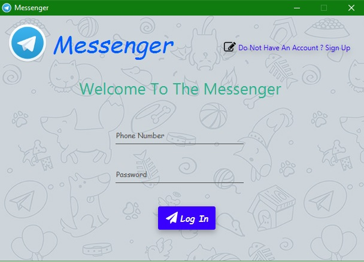
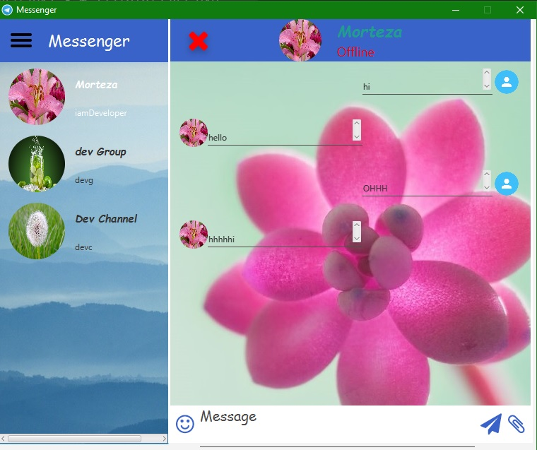
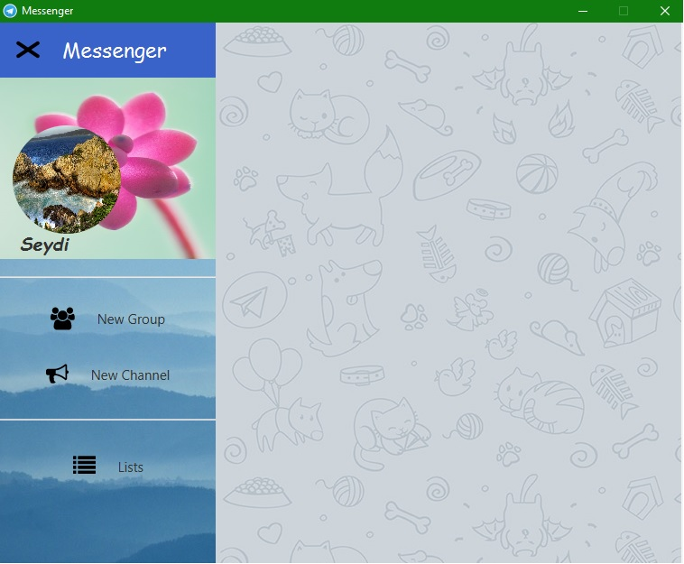
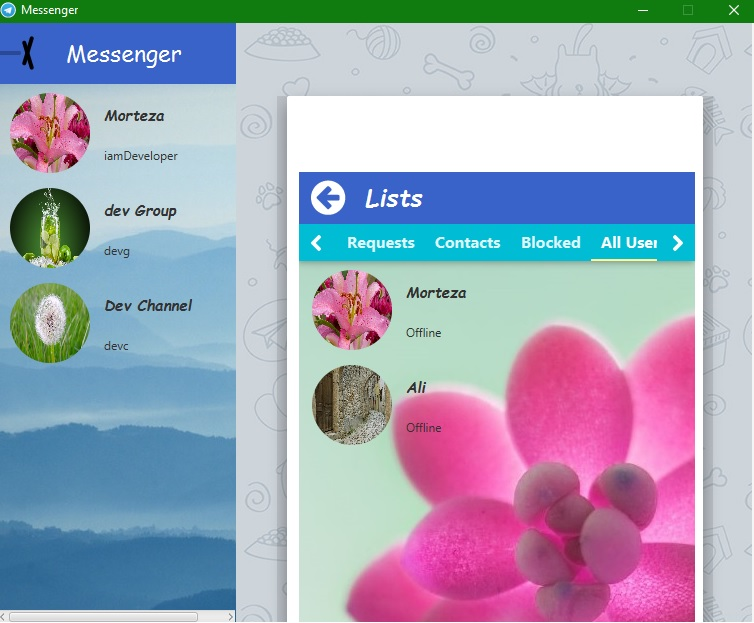
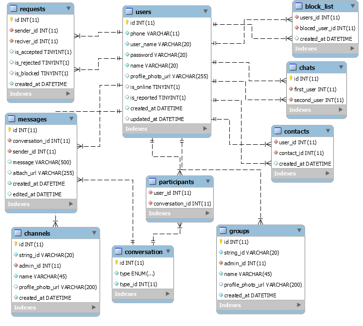

# Messenger

#### Messenger With JAVA Programming Language, JavaFX, JFoenix Material Design Library Whit Both Server And Client Side.

## Features

##### Server :

* It's Multi Threaded And Many Clients Can Connect Concurrently.
* Uses JSON To Talk To Clients.
* There is Another Port To Send And Receive Files.
* Uses MySQL Database.

##### Client :

* It's Multi Threaded For Sending And Receiving Messages And Files.
* Uses [JFoenix](https://github.com/jfoenixadmin/JFoenix) Material Design Library.
* User Can Create Groups And Channels.
* Before Start Chatting You Must Send Request To The User, He/She Can Accept, Block Or Reject Your Request.
* User Can See Requests, Contacts, Blocked, All Users, Groups, Channels in List Menu.
* User Can Attach Any File To Messages.
* Uses JSON To Talk To Server.
* Show PopUp Notifications For Events.
* Uses [FontAwesomeFx](https://github.com/jerady/fontawesomefx-glyphsbrowser).

## Build

* Install MySQL Database.
* Add MySQL ConnectorJ To Server Module Dependency.
* Add `Server/jarDependency` To Server Module And `Client/jarDependency` To Client Module.
* Run `Server/Database/sql.sql` For Creating "Messenger" Schema And It's Tables.
* Compile And Enjoy!!!!

## Previews

##### Login Or Register Window :

##### Chat Window :

##### Drawer :

##### Lists : 

## Database

## TODO

You Can Add So Many Features To This Messenger, After That You Should Make `Pull Request` To `Merge` This Changes To Main Source Code (After My Review And Approval). 